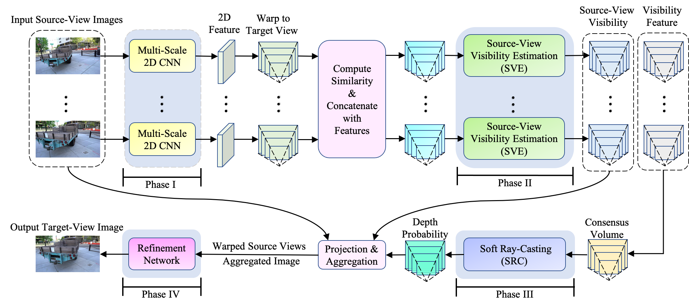

# Self-Supervised Visibility Learning for Novel View Synthesis

This contains the codes for cross-view geo-localization method described in: Self-Supervised Visibility Learning for Novel View Synthesis, CVPR2021. 

# Abstract
We address the problem of novel view synthesis (NVS) from a few sparse source view images. 
Conventional image-based rendering methods estimate scene geometry and synthesize novel views in two separate steps. 
However, erroneous geometry estimation will decrease NVS performance as view synthesis highly depends on the quality of estimated scene geometry.
In this paper, we propose an end-to-end NVS framework to eliminate the error propagation issue. 
To be specific, we construct a volume under the target view and 
design a source-view visibility estimation (SVE) module to determine the visibility of the target-view voxels in each source view. 
Next, we aggregate the visibility of all source views to achieve a consensus volume.
Each voxel in the consensus volume indicates a surface existence probability.
Then, we present a soft ray-casting (SRC) mechanism to find the most front surface in the target view (\ie, depth). Specifically, our SRC traverses the consensus volume along viewing rays and then estimates a depth probability distribution. 
We then warp and aggregate source view pixels to synthesize a novel view based on the estimated source-view visibility and target-view depth. 
At last, our network is trained in an end-to-end self-supervised fashion, thus significantly alleviating error accumulation in view synthesis.  
Experimental results demonstrate that our method generates novel views in higher quality compared to the state-of-the-art. 

### Experiment Dataset
We use two existing dataset to do the experiments

- Tanks and Temples dataset: the dataset can be accessed from https://github.com/intel-isl/FreeViewSynthesis
	
- DTU dataset: we use the DTU dataset processed by https://github.com/YoYo000/MVSNet

### Codes
The codes borrow heavily from https://github.com/YoYo000/MVSNet and https://github.com/yhw-yhw/D2HC-RMVSNet. 

We use Tensorflow==1.13.1, cuda==10.0. 

Please first download the pretrained weights of VGG19 "imagenet-vgg-verydeep-19.mat" [here](https://www.vlfeat.org/matconvnet/pretrained/#downloading-the-pre-trained-models), and put it under the folder of "Perloss". This is for the perceptual loss. 

To train the model, please run:

python trainNVS.py --data_root_dir $YOUR_DATA_ROOT_DIR --dataset_name TanksandTemples --view_num $VIEW_NUM --max_d $MAX_D --max_w 448 --max_h 256

For testing on the Tanks and Temples:

python testNVS.py --data_root_dir $YOUR_DATA_ROOT_DIR --dataset_name TanksandTemples --view_num $VIEW_NUM --max_d $MAX_D --max_w 448 --max_h 256 --output_dir $YOUR_OUTPUT_DIR --dataset Truck

python testNVS.py --data_root_dir $YOUR_DATA_ROOT_DIR --dataset_name TanksandTemples --view_num $VIEW_NUM --max_d $MAX_D --max_w 448 --max_h 256 --output_dir $YOUR_OUTPUT_DIR --dataset Train

python testNVS.py --data_root_dir $YOUR_DATA_ROOT_DIR --dataset_name TanksandTemples --view_num $VIEW_NUM --max_d $MAX_D --max_w 448 --max_h 256 --output_dir $YOUR_OUTPUT_DIR --dataset M60

python testNVS.py --data_root_dir $YOUR_DATA_ROOT_DIR --dataset_name TanksandTemples --view_num $VIEW_NUM --max_d $MAX_D --max_w 448 --max_h 256 --output_dir $YOUR_OUTPUT_DIR --dataset Playground

For testing on the DTU dataset:

python testNVS.py --data_root_dir $YOUR_DATA_ROOT_DIR --dataset_name DTU --view_num $VIEW_NUM --max_d $MAX_D --max_w 320 --max_h 256 --output_dir $YOUR_OUTPUT_DIR 

## SSIM and PSNR
For evaluation on the Tanks and Temples:

python metrics_tf.py --dataset_name TanksandTemples --view_num $VIEW_NUM --max_d $MAX_D --max_w 448 --max_h 256 --output_dir $YOUR_OUTPUT_DIR --dataset Truck

python metrics_tf.py --dataset_name TanksandTemples --view_num $VIEW_NUM --max_d $MAX_D --max_w 448 --max_h 256 --output_dir $YOUR_OUTPUT_DIR --dataset Train

python metrics_tf.py --dataset_name TanksandTemples --view_num $VIEW_NUM --max_d $MAX_D --max_w 448 --max_h 256 --output_dir $YOUR_OUTPUT_DIR --dataset M60

python metrics_tf.py --dataset_name TanksandTemples --view_num $VIEW_NUM --max_d $MAX_D --max_w 448 --max_h 256 --output_dir $YOUR_OUTPUT_DIR --dataset Playground

For evaluation on the DTU dataset:

python metrics_tf.py --dataset_name DTU --view_num $VIEW_NUM --max_d $MAX_D --max_w 320 --max_h 256 --output_dir $YOUR_OUTPUT_DIR

## LIPIS
The codes for LIPIS evaluation are from [LIPIS](https://github.com/richzhang/PerceptualSimilarity.git). 
Please install the package first:  pip install lpips
we use torch==1.4.0, torchvision==0.5.0

For evaluation on the Tanks and Temples:

python metrics_LIPIS.py --dataset_name TanksandTemples --view_num $VIEW_NUM --max_d $MAX_D --max_w 448 --max_h 256 --output_dir $YOUR_OUTPUT_DIR --dataset Truck

python metrics_LIPIS.py --dataset_name TanksandTemples --view_num $VIEW_NUM --max_d $MAX_D --max_w 448 --max_h 256 --output_dir $YOUR_OUTPUT_DIR --dataset Train

python metrics_LIPIS.py --dataset_name TanksandTemples --view_num $VIEW_NUM --max_d $MAX_D --max_w 448 --max_h 256 --output_dir $YOUR_OUTPUT_DIR --dataset M60

python metrics_LIPIS.py --dataset_name TanksandTemples --view_num $VIEW_NUM --max_d $MAX_D --max_w 448 --max_h 256 --output_dir $YOUR_OUTPUT_DIR --dataset Playground

For evaluation on the DTU dataset:

python metrics_LIPIS.py --dataset_name DTU --view_num $VIEW_NUM --max_d $MAX_D --max_w 320 --max_h 256 --output_dir $YOUR_OUTPUT_DIR

### Models:
Our trained model is available in [here](https://anu365-my.sharepoint.com/:u:/g/personal/u6293587_anu_edu_au/EbtzMMMQLtRAj2UuWLYXoeYBpjnocjkAL-hsKNVG1NQUGw?e=gRhtfL).

### Tensorflow 2.0
If you are using tensorflow>=2.0, please refer to [here](https://www.tensorflow.org/guide/migrate) to update the codes. 

### Publications
This work is published in CVPR 2021.  
[Self-Supervised Visibility Learning for Novel View Synthesis]

If you are interested in our work and use our code, we are pleased that you can cite the following publication:  
*Yujiao Shi, Hongdong Li, Xin Yu. Self-Supervised Visibility Learning for Novel View Synthesis.*

@inproceedings{shi2021selfsupervised,
  title={Self-Supervised Visibility Learning for Novel View Synthesis.*},
  author={Yujiao Shi and Hongdong Li and Xin Yu},
  booktitle={Proceedings of the IEEE Conference on Computer Vision and Pattern Recognition},
  year={2021}
}

